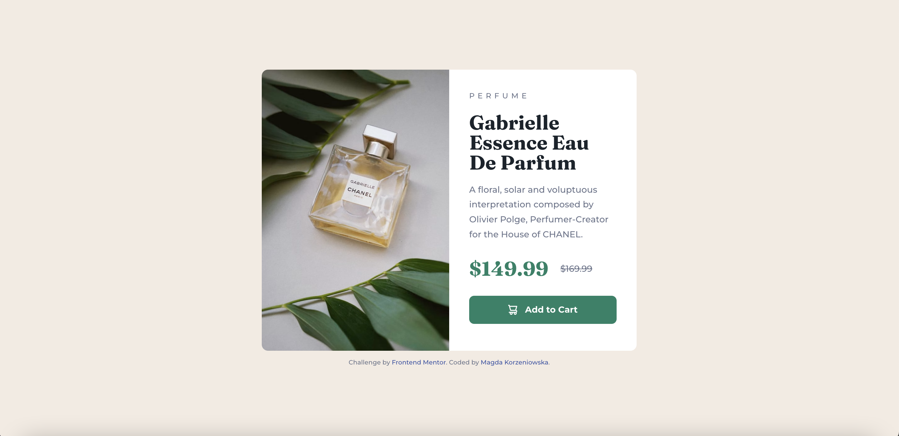

# Product Preview Card Component Challenge

This is a solution to the [Product preview card component challenge on Frontend Mentor](https://www.frontendmentor.io/challenges/product-preview-card-component-GO7UmttRfa). Frontend Mentor challenges help you improve your coding skills by building realistic projects.

### [Live](https://magda-korzeniowska.github.io/product-preview-card-frontendmentor/) | [Solution](https://www.frontendmentor.io/solutions/mobilefirst-solution-using-flexbox-VKWWWS5Dbi) | [Challenge](https://www.frontendmentor.io/challenges/product-preview-card-component-GO7UmttRfa)

## Table of contents

- [Overview](#overview)
  - [Screenshot](#screenshot)
  - [Built with](#built-with)

## Overview

### Screenshot

### Built with

- Semantic HTML5 markup
- CSS custom properties
- Flexbox
- Mobile-first workflow
